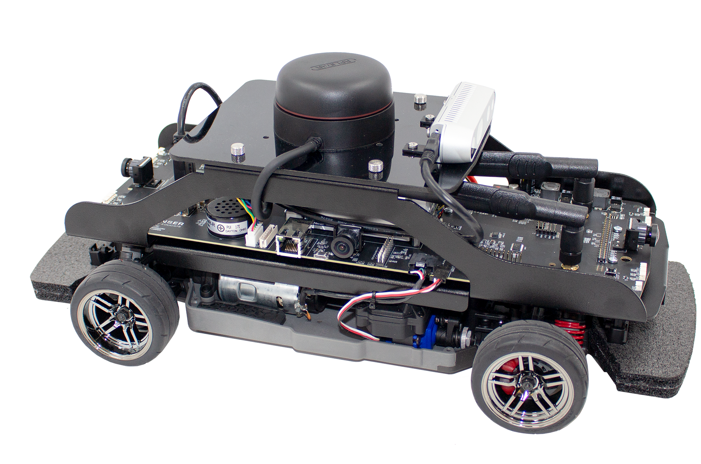
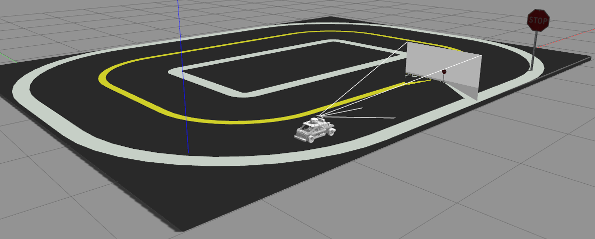

# Autonomous Driving using SLAM

This project implements a prototype of an autonomous vehicle on the Quanser QCar.

<p align="center">
    
</p>

## Goals
The main goal of this project is to learn about the different components that make up a self driving car stack. This project explores different approaches to perception, mapping, planning and control systems. 

The modules implemented in this project are:
1. Hardware interface with camera, depth, imu, and motor control.
2. Image processing pipeline to calibrate and synchronize data.
2. Perception system including lane detection and object detection.
3. Planning system to control the cars behaviour.
4. Control system to effectively move the car.
5. Simulation using CARLA and Gazebo.

## Getting Started
This project is implemented using the Robotic Operating System (ROS). The catkin workspace is stored in the `ros` folder. 

To build the workspace:
```
cd ros
source /opt/ros/melodic/setup.bash # The QCar uses melodic
catkin_make -DPYTHON_EXECUTABLE=/usr/bin/python3
source devel/setup.bash
```

## Hardware Interface
The hardware interface contains nodes to interact with the hardware available on the car. This is implemented in the `qcar` package in the ros workspace. 

The following nodes are implemented:
- `commandnode.py` - This is an interface to interact with a Logitech F710 controller
- `csinode.py` - This is an interface to interact with the fisheye cameras on the car
- `lidarnode.py` - This is an interface to interact with the RP Lidar.
- `rgbdnode.py` - This is an interface to interact with the Intel Realsense D435 camera
- `qcarnode.py` - This is an interface to interact with the motors on the car

Launch files have been included in the qcar package to connect to these sensors. More detail can be found in the package documentation. 

To run the vehicle and sensors manually using the controller:
```
roslaunch qcar manual_control.launch
```

## Perception
The perception interface is implemented in the `qcar_perception` package.

The following nodes are implemented: 
- `object_detection.py` - This node detects objects using a YOLOv3 neural network 
- `lane_detection.py` - This node detects lane lines using computer vision techniques

## Planning
The planning system is implemented in the `qcar_planning` package.


## Simulation
### Gazebo
Gazebo is an open source simulation platform developed by the same team as ROS. The team used Gazebo to model accurate environments to test the autonomous driving software in. This was used heavily for developing how the perception and planning systems interact. 

<p align="center">
    
</p>

More specific information for running the gazebo simulation can be found in `qcar_gazebo`.


## CARLA Integration
CARLA is an open source autonomous driving simulator built on the Unreal Engine. CARLA was used to test the accuracy of the perception systems implemented, and extend the project beyond the QCar. 
